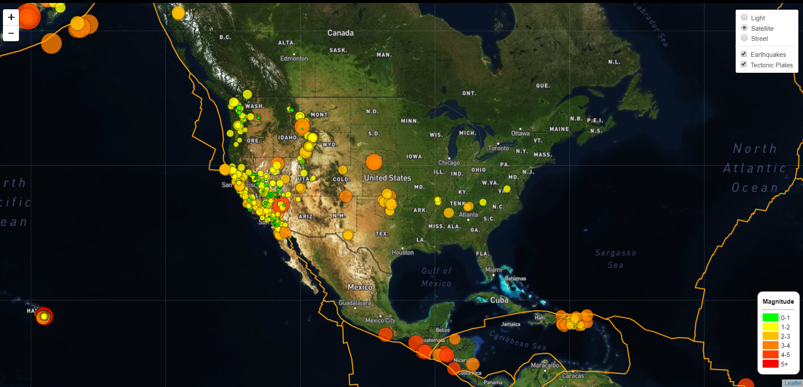

# Earthquake Visualization Using Leaflet

Data was gathered from the United States Geological Survey page from the updated [USGS GeoJSON Feed](https://earthquake.usgs.gov/earthquakes/feed/v1.0/geojson.php) that mapped earthquakes that occurred within the last 7 days. Leaflet was used to map the latitude and longitude of each data point. The size and color of each point was determined by the magnitude of the recorded information. 

The visualization can be viewed on https://victoria-lam.github.io/Earthquake_Visualization/.

